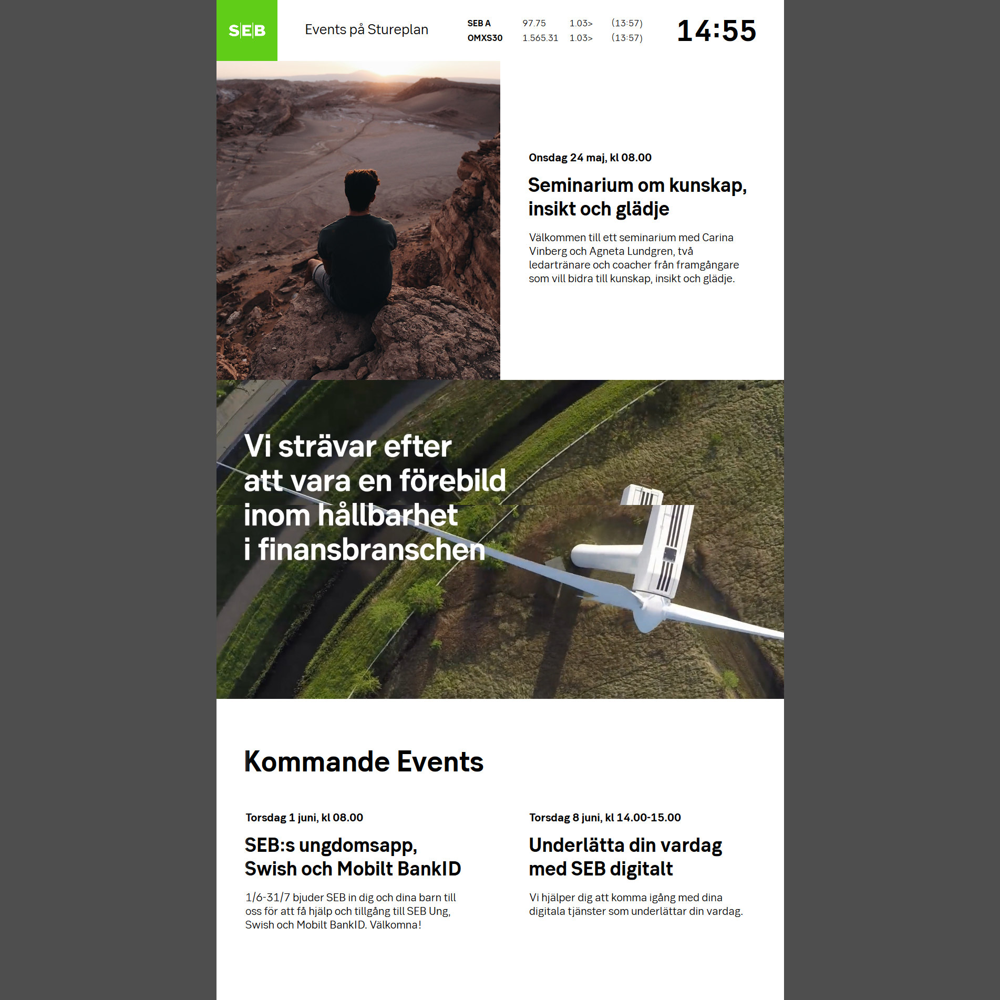

# seb-design-and-frontend-for-tv-screens-example

Example of coding for big TV screens - SEB PROJECT

# Demo
<a href="http://mze.ninja/demos/seb/tv-fullhd-version/" target="_blank">TV / fullHD Version</a>  
<a href="http://mze.ninja/demos/seb/web-version/" target="_blank">WEB / Responsive Version</a>
